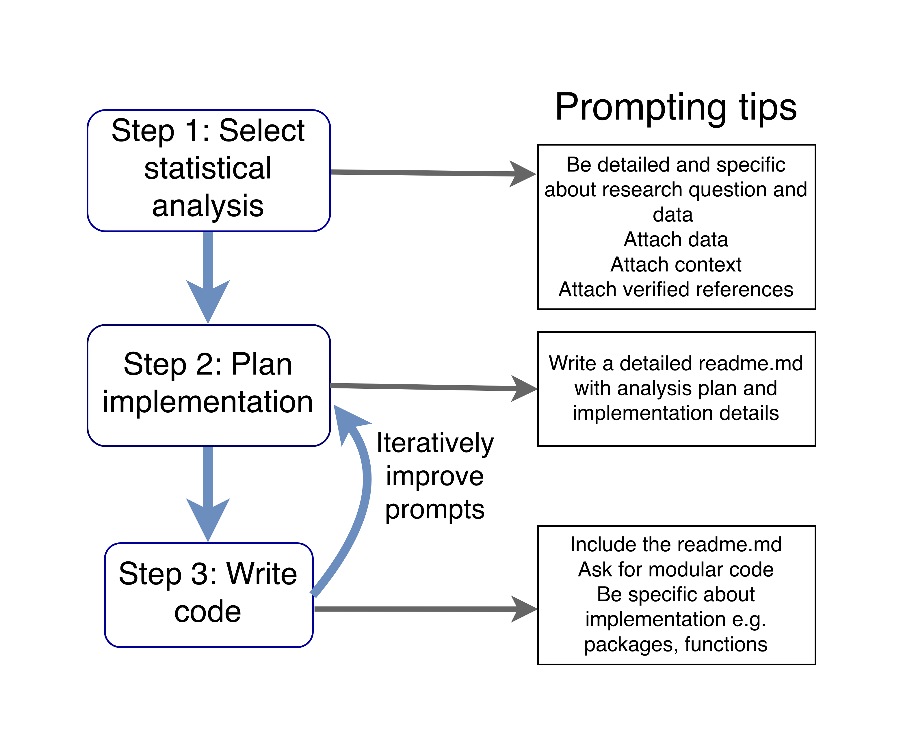

--- 
title: "Prompting large language models for quality ecological statistics"
author: "CJ Brown (c.j.brown@utas.edu.au)"
date: "`r Sys.Date()`"
description: |
  Perspective article on prompting
github-repo: cbrown5/R-llm-workshop
bibliography: references.bib
output: word_document  
---

Christopher J. Brown^1,2^ &  Scott Spillias^2,3^

1. Institute for Marine and Antarctic Studies, University of Tasmania, Hobart, Tasmania

2. Centre for Marine Socio-Ecology, University of Tasmania, Hobart, Australia

3. CSIRO Environment, Hobart, Australia


Contact: c.j.brown@utas.edu.au

**Citation: Brown, Spillias (2025). Quality statistics with large language models. Unpublished manuscript. URL: https://www.seascapemodels.org/R-llm-workshop/quality-stats-with-llm-manuscript.html**

## Abstract

Large language models (LLMs) are rapidly transforming scientific workflows, including statistical analyses in ecological sciences. While these AI tools offer impressive capabilities for code generation and analytical guidance, evaluations reveal significant limitations in their reasoning for standard statistical tests. Ecological statistics typically require special consideration due to spatial and temporal structuring, so LLM performance on these tasks is likely to be worse than for other disciplines. This perspective addresses the need for effective prompting guidelines to ensure quality statistical analyses when using LLMs. Drawing on empirical evaluations and practical experience, we provide a framework for ecological scientists to leverage these powerful tools while maintaining statistical rigor. Key recommendations include: separating workflows into components that align with LLM strengths and limitations; providing context through domain knowledge, data summaries, and research questions; combining context with structured prompting techniques like Chain of Thought reasoning; and maintaining human oversight of statistical decisions. By understanding LLM capabilities and employing these prompting strategies, researchers can harness these technologies to improve rather than compromise statistical quality in ecological research. Future research should focus on evaluations of LLMs for ecological statistics, development of specialized prompting strategies, and integration of LLMs with traditional statistical approaches.

## Introduction

Large language models (LLMs) are rapidly transforming scientific workflows, with profound implications for statistical analysis in environmental sciences. Most researchers now incorporate LLMs into their workflows [@liao2024llms], with many specifically using them for statistical advice and code generation [@jansen2025leveraging; @zhu2024large]. The appeal is clear: LLMs almost instantly generate statistical code and analyses that would traditionally require extensive training and time to develop. For example, researchers can now produce a complete bioinformatics analysis analysis—including code and visualizations [@jansen2025leveraging] in under 15 minutes. LLMs can also interpret statistics and figures to produce written results.

The efficiency of relying on LLMs for statistics comes with significant risks. Recent evaluations reveal concerning limitations in LLMs' statistical reasoning abilities. One study found that accuracy of late 2024 LLMs for suggesting appropriate statistical tests was typically below 40% for anything beyond basic descriptive statistics [@zhu2024large]. Crucially, the quality of statistical advice from LLMs depends heavily on how questions are framed [@onan2024assessing; @zhu2024large; @jansen2025leveraging] — effective prompting strategies can almost double the accuracy of recommendations. Present evaluations of LLMs are focused on statistical analyses where samples are independent. It is likely that their performance is significantly poorer for the complex dependence structures and observation patterns that are common in ecology. 

This perspective article addresses the urgent need for guidelines on using LLMs for statistical analysis in ecological research. As LLM adoption outpaces formal evaluation, we cannot wait for comprehensive peer-reviewed assessments before establishing best practices. Drawing on empirical evaluations, practical experience, and broader AI literature, we provide a framework for leveraging these powerful tools while maintaining statistical rigor. By understanding LLM capabilities and limitations and employing structured prompting strategies, researchers can harness these technologies to enhance rather than compromise statistical quality in environmental research. The guidelines presented here aim to help environmental scientists navigate this rapidly evolving landscape responsibly and effectively.

## Challenges for statistical analysis quality in environmental sciences

Statistical analysis in ecological sciences faces numerous challenges that predate the emergence of LLMs but may be exacerbated by their use. Modern data analysis requires two interrelated skills: computer programming and statistical reasoning. There exists a substantial gap between specialists at the forefront of statistical computing and experts in specific ecological disciplines who use statistics irregularly [@Gilbert2024]. Environmental data often violate standard statistical assumptions, requiring specialized analytical approaches [@Gilbert2024] that may not be well-represented in the text that LLMs are trained on. Ecological analyses may also require advanced computer programming skills where it is easy to make mistakes [e.g. @kendall2019persistent]. 

Lack of statistical training among environmental scientists has long undermined research quality and application. Reproducibility is a wide-spread issue and ecology is no exception. P-hacking and other forms of bias caused by manipulating analyses after viewing results are already prevalent in ecology and evolution, often justified by researchers as necessary for career survival [@fraser2018; @forstmeier2017]. 

Accidental statistical mistakes caused by inappropraite training or misguided conventions are also an issue. Common misapplications include inappropriate transformations of response variables [@ohara2010], applying methods that assume independent samples to time-series analysis [@brown2011], using linear regression for zero-inflated data [@warton2016], conflating prediction with causality [@arif2022], and inappropriate use of multi-model averages [@bolker2024]. 

Problems can also arise from flawed implementation of ecological analysis [e.g. @kendall2019persistent]. These errors are not merely academic concerns—they can lead to misinformed policy actions with real consequences for conservation outcomes [@shoemaker2025].

## Applications and Risks of LLMs in Environmental Statistics

Large language models present both significant opportunities and challenges for statistical practice in environmental sciences. When used with appropriate guidance and oversight, these AI tools can enhance research workflows, but they also introduce risks that require careful consideration.

### Opportunities for Enhanced Statistical Practice

Ecological analysis, and data science more generally, is best done in multi-disciplinary teams [@GIBERT20184]. LLMs can democratize access to statistical expertise, providing researchers who lack ready access to statistical collaborators with guidance on appropriate methods and implementation strategies. Likewise, they can assist with scientific coding [@jansen2025leveraging] This democratization is particularly valuable in resource-constrained settings or for early-career researchers still developing their statistical abilities. For example, researchers from institutions without dedicated statistical support can leverage LLMs to explore analytical options that might otherwise be inaccessible.

Documentation and transparency are an ongoing challenge for statistical ecology [@Culina2020; @popovic2024four; @jenkins2023reproducibility]. 
When used correctly, LLMs can produce well-documented code with comprehensive comments, logical structure, and adherence to style guides—potentially improving computational reproducibility across environmental sciences. This can help improve researcher confidence about sharing their code. This advantage addresses a persistent challenge in the field, where code is typically not shared [@Culina2020; @popovic2024four].

LLMs facilitate rapid exploration of alternative analytical approaches, enabling researchers to quickly generate and compare multiple statistical strategies. This capability could support more robust sensitivity analyses, as researchers can efficiently implement various models to assess how analytical choices influence results. For instance, an ecologist studying species distributions could use an LLM to implement both frequentist and machine learning approaches to the same question, comparing outcomes without investing extensive time in coding each approach from scratch.

Beyond implementation benefits, LLMs offer valuable opportunities for statistical learning and skill development. When used as interactive tutors rather than black-box solution providers, these models can enhance researchers' statistical understanding by explaining concepts, suggesting relevant literature, and demonstrating proper implementation techniques [@ellis2023new].

### Risks and Limitations

Despite these benefits, LLMs present several specific risks for statistical practice that require careful mitigation strategies.

First, LLMs may amplify existing problems with statistical quality. By dramatically accelerating the ability to try multiple analytical approaches, LLMs could enable unprecedented levels of p-hacking and selective reporting. Researchers can now explore tens or hundreds of alternatives for solving a statistical issue in minutes, creating far more opportunities to cherry-pick favorable results. Strong research reporting standards and ethics are ultimately needed to combat this issue.

Second, LLMs exhibit overconfidence in their statistical recommendations, and this trend is worsening as models are scaled-up to large parameter sets [@zhou2024larger]. For example, they perpetuate common misunderstandings of confidence intervals and p-values [@ellis2023new] (as of Claude 4.0 this was still true). They almost always provide an answer, typically with high apparent certainty, even when their suggestions are inappropriate or incorrect. This characteristic is particularly problematic in environmental sciences, where data often have complex structures requiring specialized approaches. Current LLMs may not adequately recognize or account for these nuances of environmental data.

Third, LLMs lack true statistical understanding, despite appearing to do so [@messeri2024artificial]. Unlike traditional statistical software that implements specific algorithms, LLMs generate responses based on patterns learned from training data, they do not "understand" statistics and cannot reason in the way human experts do. They work by predicting statistically likely responses to text - therefore the challenge is to use prompts that shift the distribution of likely response to better overlap with accurate responses. This fundamental limitation means they may confidently suggest inappropriate methods [@zhou2024larger], apply internally consistent logic to the wrong question, fail to recognize violations of statistical assumptions, or generate plausible-sounding but incorrect interpretations.

Fourth, inexperienced users may be particularly vulnerable to these risks [@ellis2023new]. Without sufficient statistical background to critically evaluate LLM suggestions, researchers might implement inappropriate analyses or misinterpret results. The apparent authority and confidence of LLM responses can create a false sense of security [@messeri2024artificial], potentially leading to erroneous conclusions that influence scientific understanding and policy decisions.

Finally, there is a risk of statistical deskilling in the research community. If researchers increasingly rely on LLMs for statistical decisions without developing their own understanding, the collective statistical literacy of the field could decline over time. This would create a dangerous dependency on tools that lack true statistical reasoning capabilities.

### Toward Effective Human-AI Statistical Partnerships

The challenge is to develop workflows that maximize LLMs' strengths while compensating for their weaknesses. This requires providing sufficient context about research questions, data characteristics, and analytical constraints to guide the model toward appropriate statistical recommendations. It also involves maintaining oversight of model outputs, particularly for decisions requiring deeper statistical understanding such as model formulation, assumption checking, and result interpretation.

The opportunity lies in developing a statistical workflow that combines human expertise with LLM capabilities. In this workflow, researchers maintain responsibility for statistical decisions while using LLMs to implement analyses efficiently, explore options, and enhance documentation. This human-AI partnership represents a middle path between complete automation and traditional manual implementation—leveraging the efficiency and consistency of LLMs while preserving the critical judgment and domain expertise of human researchers. The key to this partnership is effective prompting—providing LLMs with the context, constraints, and guidance needed to generate high-quality statistical advice and code that advances rather than compromises statistical rigor in environmental research.

## LLM Overview

To develop effective prompting strategies, it's essential to understand how LLMs function. At their core, LLMs are prediction engines that generate text one token at a time based on patterns learned during training. A token is roughly equivalent to a word part, a word, or a common phrase.

Several key parameters influence LLM behavior [@boonstra2024prompt]:

1. **Temperature**: Controls randomness in token prediction. Lower temperatures (closer to 0) make responses more deterministic and conservative, while higher temperatures (greater than 1.0) increase creativity but potentially reduce reliability. For statistical applications, lower temperatures typically produce more consistent and conventional recommendations.

2. **Context window**: The amount of text an LLM can consider when generating a response. Current LLMs have context windows typically in the range from 100,000 to 2,000,000 tokens. Larger context windows allow for including more detailed information about data, research questions, and statistical requirements.

3. **Model complexity**: Different models have varying capabilities based on their size, training data, and architecture. More complex models (e.g., Claude-4.0-Opus vs. Claude-4.0-Sonnet) generally provide more nuanced statistical guidance but at higher computational and financial cost. 

4. **System prompt**: Sets the overall context and constraints for the LLM. This "behind-the-scenes" instruction shapes how the model responds to user queries and can significantly impact statistical advice quality.

5. **AI assistant, AI programmer pair**: Software that assists a user to interact with an LLM. Examples include Github Copilot and Claude Code. This software manages user interactions, including setting the system message (which may be proprietary information) and managing the context window. 

6. **Tools and MCP**: Tools allow LLMs to perform tasks. Examples include running R scripts, searching the internet and downloading online data. A common standard for tool definition is the Model Context Protocol (MCP). 

7. **Agents**: Agents are software systems that allow LLMs to iteratively develop their own task, with or without human supervision. For instance, an agent can have a tool allowing it to run and read terminal commands. This lets the agent write R scripts, run them, check for errors, and correct iteratively. Agents are most commonly used within AI assistant software like Github Copilot, thought there is some development of agents for bespoke statistical problems [@jansen2025leveraging]. 

## Prompting Guidelines Best Practices

There are now many formal evaluations of LLMs for statistical advice. However, many of these studies are not replicable and do not follow statistical best practice. For instance, they do not provide the prompts they used, do not replicate prompts (LLM responses differ ever time) or use statistics that inflate estimates of effect size [@gallo2024]. Here we summarize the handful of evaluations that provide sufficient information to assess the scientific credibility of their claims. 

The key findings of these studies are that more accurate responses are obtained when: 

- Role prompting is used, e.g. `You are an expert in the statistical analysis of ecological data`  [@jansen2025leveraging]
- Examples and reference material are included (also called one-shot or few-shot prompting) [@zhu2024large] 
- Context about the data collection process is included [@zhu2024large]
- The data are attached as part of the prompt [@jansen2025leveraging; @zhu2024large]

Providing examples that pair types of statistical questions with appropriate solutions one of the most effective approaches to improve the precision of responses [@sivarajkumar2024empirical; @zhu2024large]. This approach should be used whereever possible, however, accurate examples may not be readily available to the novice statistician. Reference material can also be provided in place of examples. For example, a user could attach a blog or package vignette that illustrates the application of an analysis to answering a research question. 

A further tactic, 'chain of thought' reasoning, has mixed success. Chain of thought reasoning encourages the model to structure its prompt as in a step-by-step way and tends to improve the quality of reasoning [@wei2022chain]. It can be as sample as adding to a prompt `Use chain of thought reasoning`. Its utility has mixed performance for statistical analyses [@jansen2025leveraging; @zhu2024large]. Chain of thought prompting is best combined with prompts that include the data and measurement context. 

Prompts that say what to do, rather than what not to do, are generally also considered be more effective [@boonstra2024prompt]. 

### Recognize different steps in workflows

It is helpful to separate statistical workflows into distinct components that align with LLM strengths and limitations:

1. **Select statistical approach**: Determining appropriate statistical methods for research questions
2. **Plan implementation**: Designing the analytical workflow and code structure
3. **Write code**: Writing the actual code to implement analyses
4. **Guidance on Interpretation**: Understanding and reporting results

We deal with steps 1-3 here. The credibility of statistical interpretation urgently needs further empirical evaluation, so we leave that for future studies.  

LLMs perform differently across these components. They excel at code generation and implementation planning but are less reliable for selecting appropriate statistical approaches or interpreting complex results. 

LLMs can be used across all of these steps, but we recommend that each step is treated separately. This encourages informed decision making and avoids making decisions on the fly. For instance, it is better to design the statistical analysis prior to setting an agent up to automate the implementation of that analysis. 

The separation of workflow steps also helps prevent overreliance on LLMs for statistical decisions. 

Below we will work through three examples that align to each of the steps above. 

### Example Step 1. Statistical approach selection

Selecting the appropriate statistical approach is a critical first step in any analysis workflow. Our example prompt demonstrates several key strategies that significantly improve LLM performance for this task:

```
You are an expert in ecological statistics with the R program.
I want to statistically test the dependence of fish abundance on coral cover. I have observations of coral cover (continuous percentage) and fish abundance (count of number of fish). Observations were made at 49 different locations. Observations were made with standardized surveys, so the area surveyed at each site was the same.
Sites are spatially clustered into different regions. Provide me with several options for statistical approaches would be appropriate for answering my research question. Also include suggestions for verification of statistical assumptions and suggestions for visualizations.  Use chain of thought to reason about each approach before providing a final summary.
I've attached the data [data] and a reference on analysis of count data with ecology [reference].
```

This example prompt integrates multiple evidence-based strategies for obtaining quality statistical advice from LLMs:

**1. Clear hypothesis and domain knowledge specification**

The prompt clearly states the research question (testing dependence of fish abundance on coral cover) and provides context about the variables (coral cover as continuous percentage, fish abundance as count data). It also requests verification steps and visualizations. This specificity helps the LLM recognize that count-appropriate methods like Poisson GLM would be suitable. Without this context, LLMs often default to inappropriate methods like linear regression for count data. 

**2. Detailed experimental/observational design context**

The prompt includes critical information about the sampling methodology (standardized surveys with equal area across sites) and spatial structure (sites clustered into regions). By explicitly stating that there is spatial structure the LLM is more likely to recommend methods that account for spatial structure in the data, such as mixed-effects models or spatial autocorrelation analyses. This contextual information is crucial for ecological data where spatial and temporal dependencies are common but often overlooked in standard statistical approaches.

**3. Attaching data and references**

A consistent finding across formal evaluations of LLMs for statistical advice [@jansen2025leveraging; @zhu2024large] is that attaching your data dramatically improves response quality. In our example, we reference attached data and a relevant ecological statistics reference. 


**4. Chain of Thought reasoning with authoritative sources**

The prompt explicitly requests Chain of Thought (CoT) reasoning [@wei2022chain]: "Use chain of thought to reason about each approach before providing a final summary." This prompting strategy encourages step-by-step analytical thinking, which is most effective when combined with authoritative references [@zhu2024large].

**5. Iterative refinement through follow-up prompts**

The initial prompt can be enhanced through follow-up prompts. For instance, you could use a web search tool to gain further reference information: 

```
Search the web to find robust recommendations for ecologists to analyze count data before proceeding with your recommendations.
```

You can also request self-evaluation:

```
Evaluate the robustness of each suggestion on a 1-10 scale and explain
the strengths and limitations of each approach. Use chain of thought to carefully think about the appropriateness of each suggestion.
```

Similarly to chain of thought reasoning, self evaluation is most effective if it is paired a reputable reference, because it encourages the LLM to compare its suggestions against established statistical best practices.

**6. Prompt bootstrapping**

Users can employ "prompt bootstrapping" by starting with simpler prompts and then asking the LLM to help draft more complete prompts:

```
I'm trying to improve a prompt asking an assistant for statistical advice. Here is the prompt [prompt]. What other information can I provide to improve the accuracy of the assistant's response?
```

This meta-prompting approach leverages the LLM's own capabilities to identify what additional information would be helpful. The user can then edit and refine the suggested prompt to include all relevant context about their research question, data characteristics, and analytical constraints.

### Step 2. Plan implementation

LLMs are most effectively if used via an AI assistant like github copilot. These assistants have access to context from your project files and can edit directly into documents and scripts. 

We recommend users carefully organize their their workflow and then create a project directory structure that facilitates workflow management. Being organized makes it easier for humans and AI assistants to understand the project. 

Our recommendation is to start a new folder on your computer and insert a `readme.md` file into this folder. (we prefer markdown format for this file, see supplemental material). The readme file can be developed iteratively with an LLM's help. In our readme file we include: 

- Research context
- Research aims
- Analysis methodology
- Tech context including R package preferences
- Analysis steps
- Directory structure
- Data file locations and meta-data 

The readme can be attached to every prompt to provide project context, as well as give the LLM a memory across different chat sessions. 

Information from the first step (Plan analysis) can be entered into this readme file. Then we would use the LLM to assist in filling out the other sections. An initial prompt could look like: 

```
Help me plan the steps to complete this analysis. This should include a series of scripts that we will need to make for each step of the analysis. It should also include a plan for how to structure the project directory. Create modular scripts for this analysis with separate files for data preparation, model fitting, diagnostics, and visualization. Save data files for intermediate steps. Use chain of thought reasoning to think carefully abotu each step. 
``` 

Scripts should be kept short and modular. When helping ecologists with code with often find that they write long scripts that span data wrangling to plotting and may not even evaluate in a top to bottom order! Keeping your project modular organized allows for agents to easily navigate your project and for you to more easily manage the size of prompt attachments to fit within the context window. It also lets you point precisely to files that may need attention. This structure not only improves immediate code quality but also enhances long-term project sustainability and knowledge transfer. 

You can then create the project directory, or have an AI agent do this for you (`Create the directory structure in readme.md`). 

For example, a typical project directory may look like this: 

```
my-project/
├── README.md 
├── .gitignore
├── Scripts/ # R code
│   ├── 01_data-prep.R
│   ├── 02_data-analysis.R
│   └── 03_plots.R
├── Shared/       
│   ├── Outputs/
│   │   ├── Figures/
│   │   ├── data-prep/
│   │   └── model-objects/
│   ├── Data/
│   └── Manuscripts/   
```

### Step 3. Write code 

If the data, methodology and plan are carefully documented in a readme file, starting the analysis is as simple as:

```
Start on the first step of this analysis [readme.md]. Review and update the readme when you complete this step. 
```

Starting a new chat for each discrete task will reduce syntax errors [@jansen2025leveraging]. Keep the readme.md as a memory across chat sessions. 

Further precision can be gained by adding additional context to the prompt or readme.md file. For example, you can provide implementation constraints in the `Tech context` section: 

```
Implement this analysis using the tidyverse ecosystem and INLA for Bayesian 
modeling. Follow tidyverse style guidelines and prioritize code readability.
```

It is better to say what to do, rather than what not to do [@boonstra2024prompt]. 

The rate of syntax errors can also be reduced by more than three times by allowing an agent to iterate through running and debugging [@jansen2025leveraging]. Code should be carefully reviewed by a human to ensure logical correctness, agents often produce code that is syntaxically correct, but logically flawed [@jansen2025leveraging]. The LLM can assist (but not replace) the user with a prompt such as: 

```
Review my choice of analysis from the perspective of a peer-reviewer in an ecological journal. 
```

Writing the code may not be the final step. Often when we analyse data new issues emerge, or the process of analysis helps us identify logical inconsistencies in a method. The stps above can be iterated, just be clear which step you are operating in. 

## Discussion and Conclusion

Large language models represent both opportunity and challenge for statistical practice in environmental sciences. When used thoughtfully with effective prompting strategies, they can enhance analytical workflows, improve code quality, and potentially address longstanding issues in statistical implementation. However, incritical reliance on LLMs risks perpetuating or even amplifying existing problems in statistical practice.

The prompting guidelines presented in this perspective provide a framework for leveraging LLMs while maintaining statistical rigor. By separating workflows into components that align with LLM strengths and limitations, providing appropriate context and constraints, and maintaining human oversight of critical decisions, researchers can harness these tools while mitigating their risks. Our recommendations are common sense and align closely with best-practices for ecological statistics and open data in general [@jenkins2023reproducibility; @popovic2024four] - what is better for human reproducibility is also good for LLMs efficiency. 

Several principles emerge from our perspective:

1. **Maintain critical thinking**: LLMs should complement rather than replace research expertise [@messeri2024artificial]. Researchers must critically evaluate LLM suggestions against domain knowledge and statistical principles.

2. **Provide rich context**: All of the above advice suggests using longer and more detailed prompts than we typically see our colleagues using [@boonstra2024prompt]. LLM's have context windows that allow 100,000s of tokens equivalent to several theses worth of work. Our experience is that most researchers are under-using this potential for detailed prompts. The quality of LLM statistical guidance improves dramatically when provided with detailed information about research questions, data characteristics, and analytical constraints [@zhu2024large; @jansen2025leveraging]. 

3. **Document LLM use**: Transparency about LLM use in research workflows is essential for reproducibility and evaluation. Publications should clearly describe that LLMs were used.

4. **Develop LLM literacy**: As these tools become increasingly integrated into research workflows, developing "LLM literacy"—understanding how these models work, their limitations, and effective interaction strategies—becomes an essential skill for environmental scientists [@messeri2024artificial].

The rapid evolution of LLM capabilities suggests that their role in statistical workflows will only increase. Current models already show impressive performance in code generation and implementation planning, and future models may address some of the limitations identified in statistical reasoning. However, the fundamental nature of LLMs as prediction engines rather than reasoning systems means that human oversight will remain essential for ensuring statistical quality.

### Research Needs

Research is needed to inform the appropriate use of LLMs in ecological statistics. We identify several priorities. First, we need more formal evaluations of LLM statistical performance for ecological datasets and problems. Ecological data presents unique problems for statistical analysis [@Gilbert2024] and it is not yet clear how reliable LLMs advice on these problems. 

Second, we need to develop prompting templates that novice analysts and statistical coders can use to reliably develop their analyses [@jansen2025leveraging]. These could include the recommendations above, as well as reference material that is attuned to specific types of ecological data. 

Finally, LLMs have certain biases [@messeri2024artificial; @ji2025overview], but it is not yet clear if there are important implications for ecological statistics. One bias of LLMs is towards overconfidence in their own answers being correct [@zhou2024larger]. Researchers should therefore independently validate all analyses against reputable sources. Further research is needed to understand how LLM use may bias analyses in harmful ways. 

By addressing these research needs and adopting thoughtful prompting strategies, environmental scientists can apply large language models to enhance rather than compromise statistical quality. The future of environmental statistics likely lies not in choosing between human expertise and artificial intelligence, but in developing effective partnerships that leverage the unique strengths of each.

## Acknowledgements

CJB was supported by a Future Fellowship (FT210100792) from the Australian Research Council. 

## Figures



**Figure 1**
Recommended workflow for using LLMs in statistical analysis, showing the four key steps alongside specific recommendations for effectively leveraging LLMs at each stage while maintaining scientific rigor.

## References
